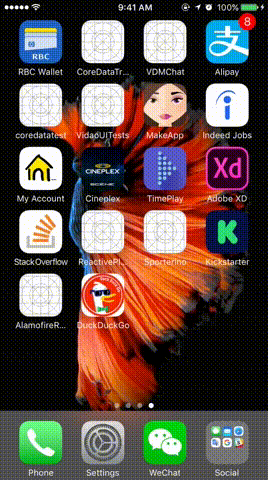

# MVVM + ReactiveCocoa 6
This project showcases [MVVM architecture](https://msdn.microsoft.com/en-us/library/hh848246.aspx) with [ReactiveCocoa 6](https://github.com/ReactiveCocoa/ReactiveCocoa) in Swift 3. It uses [DuckDuckGo](https://duckduckgo.com/) search API for display a list of search results.

### General Rules of MVVM
> - The view-model never ever uses UIKit. This rule is very important to isolate it from the view, whose UIKit is an "implementation detail". If that rule is respected, you could even have an iOS (UIKit) and a macOS (AppKit) app sharing the same view-model code.
> - The view doesn't know anything about the model.
> - The model is in complete isolation from the rest of the app.
> - Only a view can create another view.
> - Only a view-model can create another view-model (except for the very first one of your app, which should be created by the AppDelegate).

## Demo

## Reference 
- [ReactiveSwift框架](http://www.ios5.online/ios/ioskf/ioskfzh/201703/77895.html)
- [ReactiveSwift Tutorial](http://www.dongcoder.com/detail-445414.html)
- [MVVM + ReactiveCocoa 5](https://blog.joanzapata.com/mvvm-reactivecocoa-5/)
- [MVVM Tutorial with ReactiveCocoa](https://www.raywenderlich.com/74106/mvvm-tutorial-with-reactivecocoa-part-1)
- [MVVM + Swift + ReactiveCocoa 5](https://medium.com/@hilmarbirgir/mvvm-swift-reactivecocoa-5-44274edaa56e)
- [ReactiveViewModel](https://github.com/ReactiveCocoa/ReactiveViewModel)
- [ReactiveSwift Best Practices](https://github.com/ReactiveCocoa/ReactiveSwift/blob/master/Documentation/APIContracts.md#best-practices)
